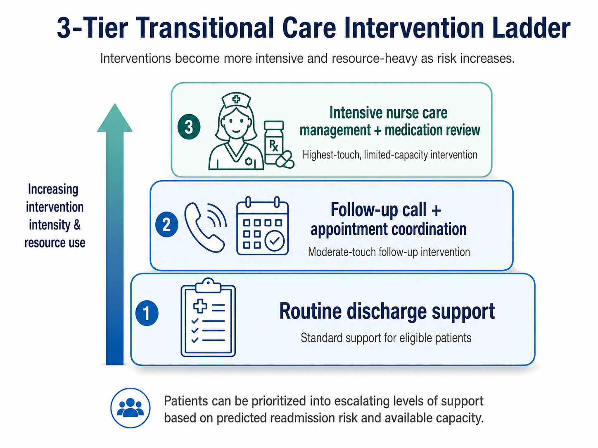

<div align="center">

# Diabetes Transitional Care Resource Allocation System

### A decision-support tool for prioritizing post-discharge care

*SMU Decision Analytics — Final Project · Chloe Barker*

[](https://huggingface.co/spaces/chloebarker/diabetes-care-management-decision-support)
[](https://youtu.be/sZp3cuSGJ84)
[](https://www.python.org/)
[](https://www.gradio.app/)

</div>

<p align="center">
  
</p>

> Hospitals can't give every diabetic patient intensive post-discharge support. This tool ranks patients by readmission risk, plans capacity and cost scenarios, and makes recommendations in CMS/AHRQ guidance, so a care-management leader can decide *who* gets scarce transitional-care resources first.

<br>

## The Business Problem

| | |
|---|---|
| **Stakeholder** | Hospital Director of Care Management / Transitional Care Manager |
| **Decision** | Which diabetes discharges get routine, enhanced, or intensive transitional-care support? |
| **Constraint** | A fixed number of staff hours and intervention slots — not everyone can be served |
| **Target outcome** | Maximize expected net value while capturing as many real 30-day readmissions as possible within capacity |

**Resource-allocation problem**: rank patients, connect the ranking to cost and capacity, and give a plain-language recommendation a hospital leader can act on.

<br>

## How It Works

- **Risk model** — calibrated, tuned Gradient Boosting on the UCI Diabetes 130-Hospitals dataset (101,766 encounters → 99,340 eligible). Patient-grouped train/test split; tuned on PR-AUC, not accuracy.
- **Risk tiers** — every scored patient maps to a support level:

<p align="center">
  
</p>

- **RAG guidance** — MiniLM embeddings + FAISS search over approved CMS/AHRQ documents (TF-IDF fallback, optional LLM answer), every response cited.
- **Fine-tuned classifier** — a text-based model evaluated honestly on the same business scorecard as the tabular model.
- **Cost/value planner** — an adjustable net-value and break-even calculator, live in the app.

<br>

## Results at a Glance

**Model comparison** (top 500 highest-risk patients — the realistic care-management capacity):

| Metric | Gradient Boosting (deployed) | Fine-Tuned Prompt Classifier |
|---|---|---|
| PR-AUC | **0.241** | 0.147 |
| Precision @ 500 | **40.8%** (≈2 in 5) | 23.0% |
| Recall @ 500 | **9.1%** (≈1 in 11) | 5.1% |
| Lift | **3.6×** vs. random | 2.0× |
| Readmissions captured | **204** | 115 |
| Expected net value | **+$113,700** | −$14,300 |

Gradient Boosting is the deployed triage engine; the fine-tuned classifier is the required comparison.

**Cost & value at 500 patients** (defaults: $15,000/readmission, $300/intervention, 10% effectiveness — all adjustable in-app):

| Readmissions avoided | Gross avoided cost | Intervention cost | Net value | Break-even effectiveness |
|---|---|---|---|---|
| 17.6 | $263,700 | $150,000 | +$113,700 | 5.7% |

<br>

## What's Inside

```text
uci-diabetes-readmission-project/
├── README.md
├── diabetes_final_project.ipynb   Full pipeline: cleaning, EDA, modeling, RAG, fine-tuning, cost analysis
├── Final_Project_Chloe_Barker.pptx  Presentation deck
├── documents/                     Instructions, proposal, and individual reflection
├── data/                          UCI dataset + ID lookup tables
├── images/                        Banner and risk-tier graphics
└── app/                           Deployed Gradio app
    ├── app.py                     Score / Plan / Guidance / Model tabs
    ├── requirements.txt
    ├── pdfs/                      RAG source documents (CMS HRRP + AHRQ Project RED)
    └── artifacts/                 Saved model, scored samples, fine-tuning outputs
```

<br>

## Tech Stack

`Python` · `pandas` / `scikit-learn` · `sentence-transformers` (MiniLM) · `FAISS` · `pypdf` · `OpenAI API` (optional) · `Gradio` · `Hugging Face Spaces`

<br>

## Running It Locally

```bash
git clone <this-repo-url>
cd uci-diabetes-readmission-project/app
pip install -r requirements.txt
python app.py
```


